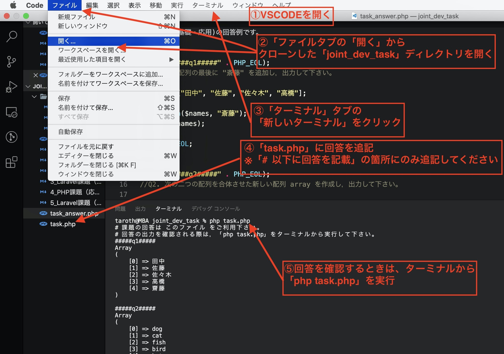

# やんばるエキスパート PHP 課題（基礎）

PHP の基礎力を高めることがプログラマーとしての生産性を高めてくれます。

現場に入った時にコードをスラスラ書くためにも、スラスラ読み解くためにも、ぜひ問題をこなして基礎力を磨いていって下さい。

## 教材のご案内

- やんばるエキスパート教材：https://www.yanbaru-code.com/texts?genre=PHP

## PHP課題の提出の流れ

### 提出用ファイルの準備
- 回答用のファイルを用意しております。[課題リポジトリ](https://github.com/yuya-ishikawa-qa/joint_dev_task)を Fork して clone してからご利用下さい。<br>

 1. [課題リポジトリ](https://github.com/yuya-ishikawa-qa/joint_dev_task)にアクセス
 2. 「Fork」をクリック
  
3. リポジトリの URL をコピー
  
4. ターミナルで（作業ディレクトリまで移動してから）以下コマンド実行
  ```
  git clone {コピーしたURL}
  ```
### 課題の進め方
- 課題の回答は `task.php` にコードを書いて進めていってください。
- ご自身が書いたコードの内容が正しいかどうかを確認する時は、`$ php task.php` をターミナルから実行して下さい。このコマンドを実行することでPHPコードが実行されて出力結果がターミナルに表示されます。
  
- どうしても回答が分からない場合は `task_answer.php` をご参考下さい。

## 提出方法について

**※課題提出の前には必ず`$ php task.php` を実行し、課題通りの出力ができていることを確認してください。**

- 数問解かれましたら、GitHub にプッシュし、Slack の「課題提出」チャンネルに連絡下さい。(全部終わった段階で提出する必要はありません。こまめに提出いただいて問題ありません)
  - クローンをした時点で、プッシュ先のリポジトリが Git に登録されています。`git init`, `git remote add ~~~`は不要です
  - 問題には「積み上げ要素」があり、早めにコードレビューを受けて軌道修正した方が効率がよくなります。全て解いてからのレビュー依頼は控えていただきたいと思います。

## 回答する際の注意点

- 提出前に出力を確認し、問題に対して回答できているかを確認して下さい。
- PHP には便利な関数が豊富に用意されています。「この操作を実現できる関数はないかな？」と検索するクセを付けて下さい。
- 可読性を高めるため、インデント幅にも気を付けるようにして下さい。

## Q1. 次の配列の最後に "斎藤" を追加し、出力して下さい。

ヒント：検索キーワードは「php 　配列　要素を追加」

```
$names = ["田中", "佐藤", "佐々木", "高橋"];
```

期待する配列の出力

```
Array
(
    [0] => 田中
    [1] => 佐藤
    [2] => 佐々木
    [3] => 高橋
    [4] => 斎藤
)
```

## Q2. 次の二つの配列を合体させた新しい配列 `$array` を作成し、出力して下さい。

ヒント：検索キーワードは「php 　配列　結合」

```
$array1 = ["dog", "cat", "fish"];
$array2 = ["bird", "bat", "tiger"];
```

## Q3. 次の配列の中に `3` がいくつあるかを出力するコードを書き、出力して下さい。

ヒント：検索キーワードは「foreach 　配列 重複」

```
$numbers = [1, 5, 8, 10, 2, 3, 2, 3, 1, 4, 5, 9];
```

## Q4. 次の配列から `null` の要素を削除し、出力して下さい。（新しい配列を作成せずに実現して下さい）

ヒント：検索キーワードは「配列　特定　重複　削除」

```
$sports = ["サッカー", "フットサル", null, "野球", "バスケ", null, "バレー"];
```

## Q5. 配列が空であれば `true`、1 つ以上の要素があれば `false` を出力するコードを書いて下さい。

例

```
$array1 = [];
// 実行結果
true

$array2 = [1, 5, 8, 10];
// 実行結果
false
```

## Q6. 次の配列から、期待された結果の配列 `$numbers2` を作成し、出力して下さい。

```
$numbers1 = [1, 2, 3, 4, 5];
```

期待する配列の出力

```
Array
(
    [0] => 10
    [1] => 20
    [2] => 30
    [3] => 40
    [4] => 50
)
```

## Q7. 次の配列の要素を `文字列` から `数字` に変換し、出力して下さい。（新しい配列を作成せずに実現して下さい）

```
$array = ["1", "2", "3", "4", "5"];
```

期待する配列

```
Array
(
    array(5) {
        [0]=>
        int(1)
        [1]=>
        int(2)
        [2]=>
        int(3)
        [3]=>
        int(4)
        [4]=>
        int(5)
    }
)

```

## Q8. 期待する出力結果になるようにコードを書き加えて下さい。

```
$programming_languages = ["php", "ruby", "python", "javascript"];

// コードを追加

// 以下は変更しないで下さい
print_r($programming_languages);
echo PHP_EOL;
print_r($upper_case_programming_languages);
```

期待する出力結果

```
Array
(
    [0] => Php
    [1] => Ruby
    [2] => Python
    [3] => Javascript
)

Array
(
    [0] => PHP
    [1] => RUBY
    [2] => PYTHON
    [3] => JAVASCRIPT
)
```

## Q9. 次の配列を用いて、期待通りの出力結果になるようにコードを書いて下さい。

```
$names = ["田中", "佐藤", "佐々木", "高橋"];
```

期待結果

```
Array
(
    [0] => 会員No.1 田中
    [1] => 会員No.2 佐藤
    [2] => 会員No.3 佐々木
    [3] => 会員No.4 高橋
)
```

## Q10. 次の配列の各要素について、 `うに` という文字列が含まれていれば「好物です」と表示し、そうでなければ「まぁまぁ好きです」と出力するコードを書いて下さい。

```
$foods = ["いか", "たこ", "うに", "しゃけ", "うにぎり", "うに軍艦", "うに丼", "高級なうに"];
```

## Q11. 次の配列を用いて、期待する出力結果になるようにコードを書いて下さい。

```
$sports = ["サッカー", "バスケ", "野球", ["フットサル", "野球"], "水泳", "ハンドボール", ["卓球", "サッカー", "ボルダリング"]];
```

期待する出力結果

```
ユーザーの趣味一覧
No1 サッカー
No2 バスケ
No3 野球
No4 フットサル
No5 水泳
No6 ハンドボール
No7 卓球
No8 ボルダリング
```

## Q12. 次の連想配列から `name` の値を出力して下さい。

```
$data = ["user" => ["name" => "satou", "age" => 33]];
```

## Q13. 次の `$user_data` に、`$update_data` の内容を反映させ、`$user_data` の内容を書き換え、出力して下さい。

```
$user_data = ["name" => "神里", "age" => 31, "address" => "埼玉"];
$update_data = ["age" => 32, "address" => "沖縄"];
```

## Q14. 次の連想配列から全てのキー（添字）を取り出して、キーが数字である通常の配列（添字配列）を作成し、出力して下さい。

```
$data = ["name" => "satou", "age" => 33, "address" => "saitama", "hobby" => "soccer", "email" => "hoge@fuga.com"];
```

## Q15. `age` というキーが含まれている場合は `OK` 、含まれていない場合は `NG` という文字列が出力されるコードを書いて下さい。

例

```
$data1 = ["name" => "saitou", "hobby" => "soccer", "age" => 33, "role" => "admin"];
// 実行結果
OK

$data2 = ["name" => "yamada", "hobby" => "baseball", "role" => "normal"];
// 実行結果
NG
```

## Q16. 次の配列の各要素について、「私の名前は〜です。年齢は〜歳です。」と表示して下さい。

```
$users = [
    ["name" => "satou", "age" => 22],
    ["name" => "yamada", "age" => 12],
    ["name" => "takahashi", "age" => 32],
    ["name" => "nakamura", "age" => 41]
];
```
